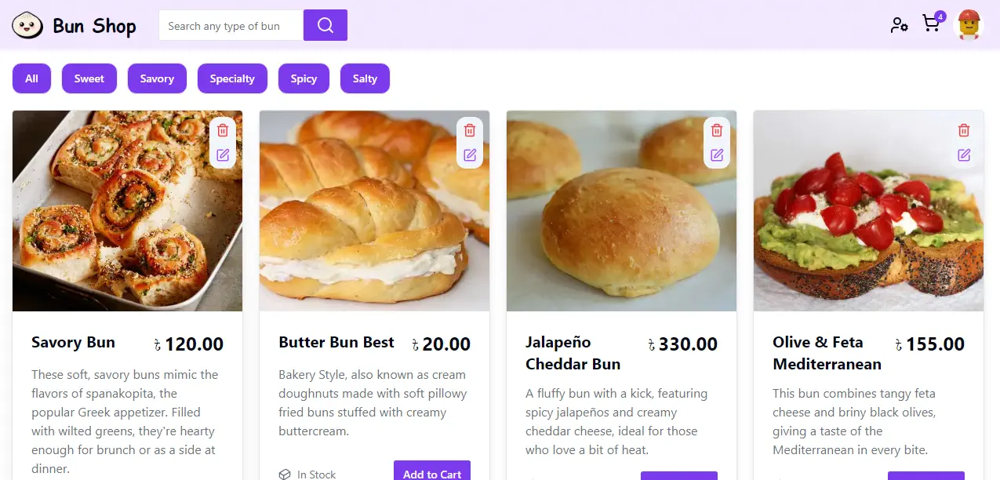
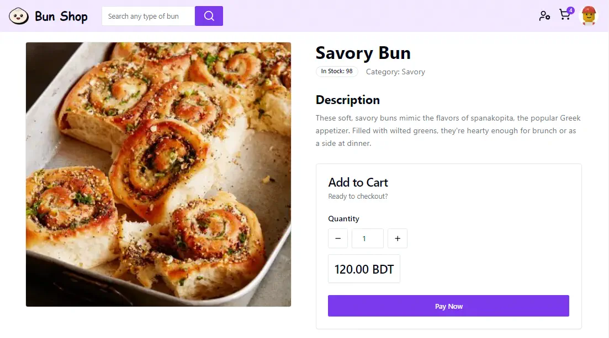
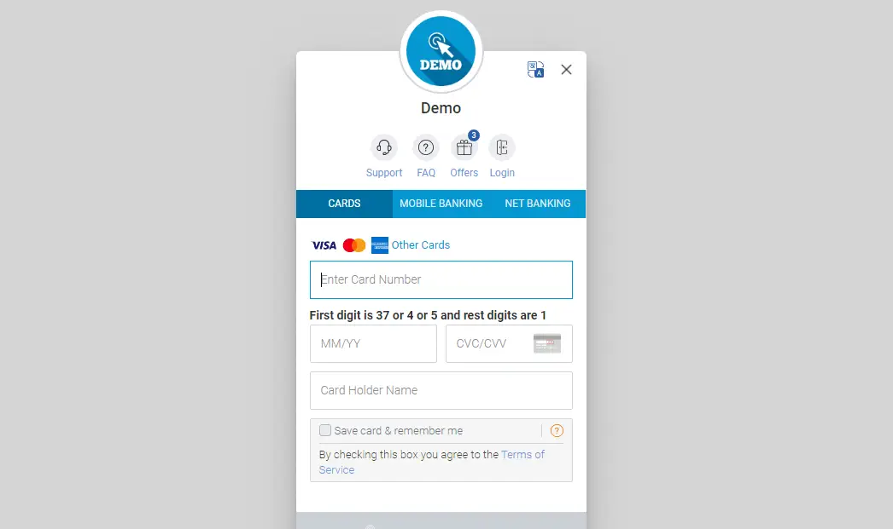
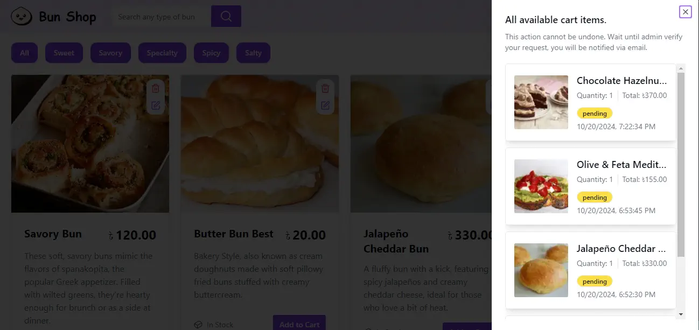
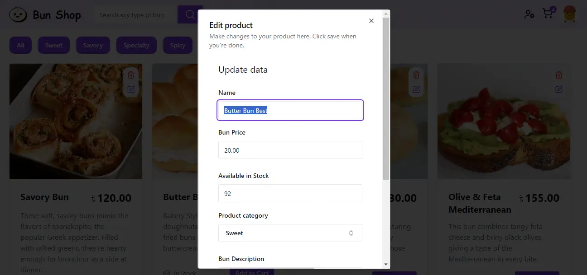
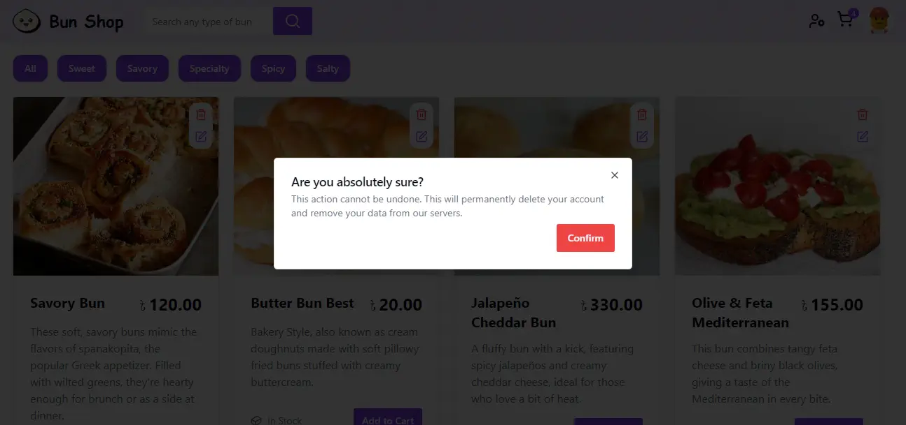
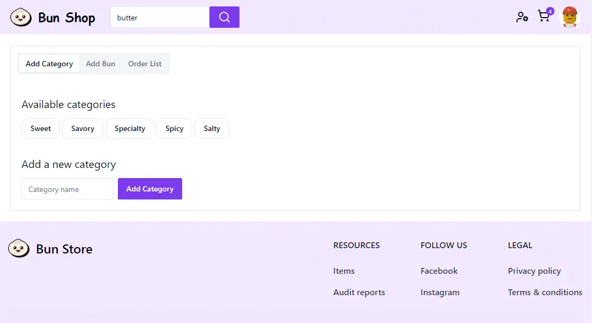
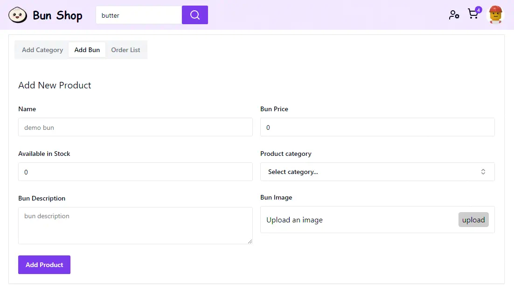
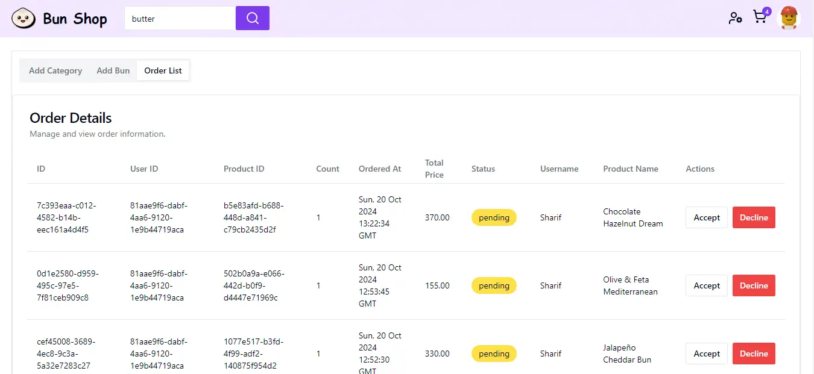

# Next Bun shop

#### Next bun shop is a full-stack bun 🍞 selling platform with online payment system (sslcommerz) integrated for order management.

---


<div style="display: flex; gap: 10px;">
    
    
</div>

---

<div style="display: flex; gap: 10px; margin-top: 12px">
    
    
    
</div>

---

<div style="display: flex; gap: 10px; margin-top: 12px">
    
    
    
</div>

---

### Created users:

email: sharif@gmail.com<br />
password: 123456789<br />
role: admin<br />
<br />
email: broken@gmail.com<br />
password: 123456789<br />
role: user<br />

---

Backend Service github: [https://github.com/Sharif-Minhaz/next-bun-shop-backend](https://github.com/Sharif-Minhaz/next-bun-shop-backend)

Payment service github: [https://github.com/Sharif-Minhaz/next-bun-shop-payment-gateway-sslcommerz-api](https://github.com/Sharif-Minhaz/next-bun-shop-payment-gateway-sslcommerz-api)

This is a [Next.js](https://nextjs.org/) project bootstrapped with [`create-next-app`](https://github.com/vercel/next.js/tree/canary/packages/create-next-app).

## Getting Started

First, run the development server:

```bash
npm run dev
# or
yarn dev
# or
pnpm dev
# or
bun dev
```

Open [http://localhost:3000](http://localhost:3000) with your browser to see the result.

You can start editing the page by modifying `pages/index.tsx`. The page auto-updates as you edit the file.

[API routes](https://nextjs.org/docs/api-routes/introduction) can be accessed on [http://localhost:3000/api/hello](http://localhost:3000/api/hello). This endpoint can be edited in `pages/api/hello.ts`.

The `pages/api` directory is mapped to `/api/*`. Files in this directory are treated as [API routes](https://nextjs.org/docs/api-routes/introduction) instead of React pages.

This project uses [`next/font`](https://nextjs.org/docs/basic-features/font-optimization) to automatically optimize and load Inter, a custom Google Font.

## Learn More

To learn more about Next.js, take a look at the following resources:

-   [Next.js Documentation](https://nextjs.org/docs) - learn about Next.js features and API.
-   [Learn Next.js](https://nextjs.org/learn) - an interactive Next.js tutorial.

You can check out [the Next.js GitHub repository](https://github.com/vercel/next.js/) - your feedback and contributions are welcome!

## Deploy on Vercel

The easiest way to deploy your Next.js app is to use the [Vercel Platform](https://vercel.com/new?utm_medium=default-template&filter=next.js&utm_source=create-next-app&utm_campaign=create-next-app-readme) from the creators of Next.js.

Check out our [Next.js deployment documentation](https://nextjs.org/docs/deployment) for more details.
